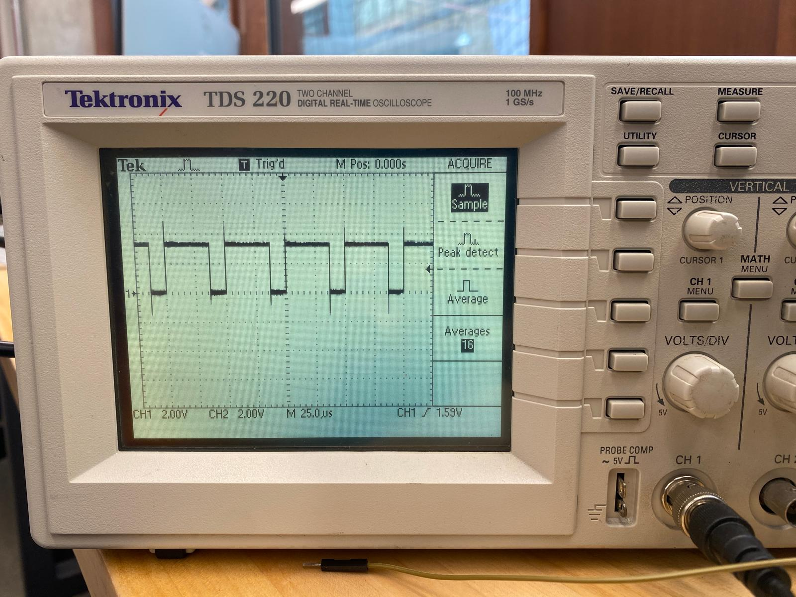
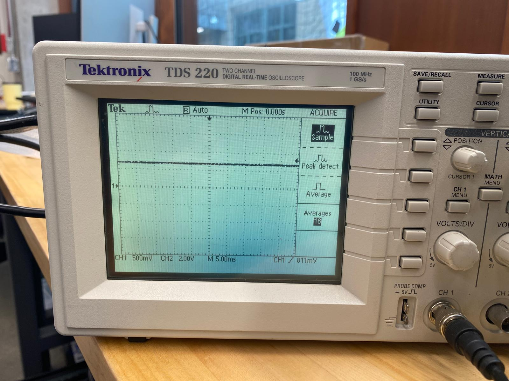
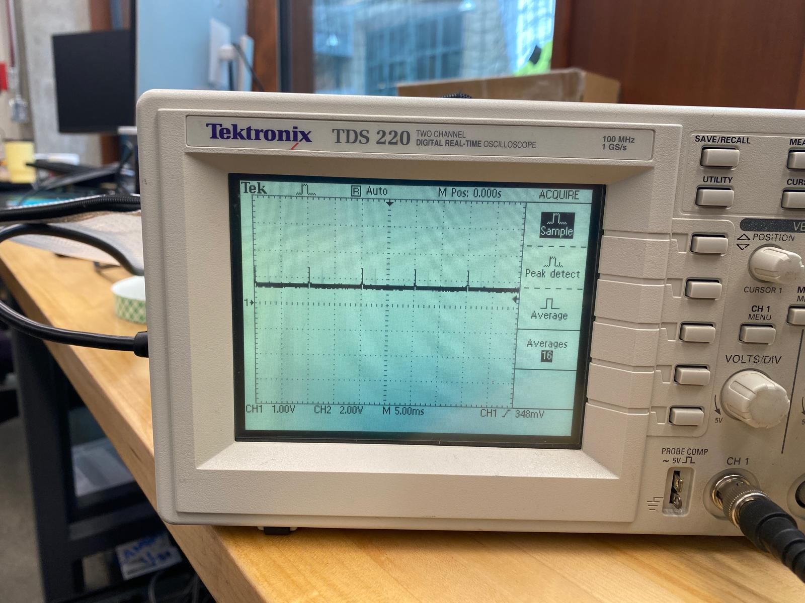
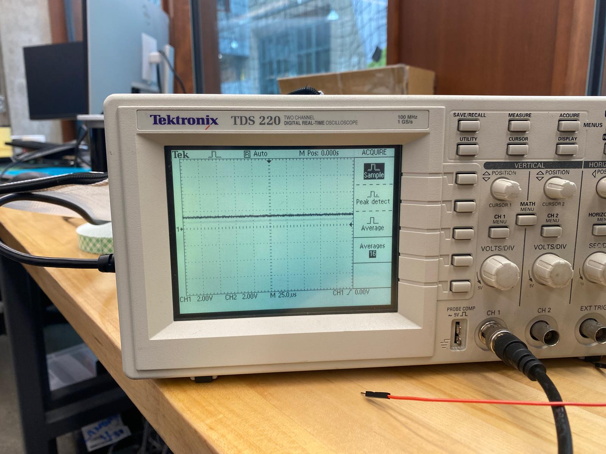

# ME333 Assignment 7
Author: Pushkar Dave

**Q24.1.2: Value of R used connected to the phototransistor is 10k $\Omega$**

**Q24.2.1: The value of PR3 should be 2399 (2400-1). This is calculated by dividing the system clock frequency (48MHz) with the PWM cycle frequency, which is 20kHz**

**Q24.2.2: (a)The OC1 waveform**

**(b) The sensor voltage Vout**

**(c) The sensor voltage Vout, without the capacitor**

The R-C combination of the capacitor and the resistor acts a low pass filter, and therefore, filters out the peaks in the waveform to give out a smooth consistent value. Therefore, when you take out the capactor, you observe some sharp peaks appear in the waveform.

**Q24.3.1: Vout for time 2-4 time periods**

**Q24.3.2: Check file `openLoopPWM.c`**